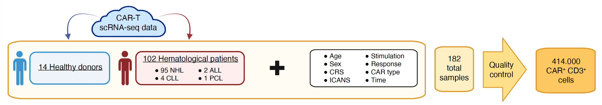
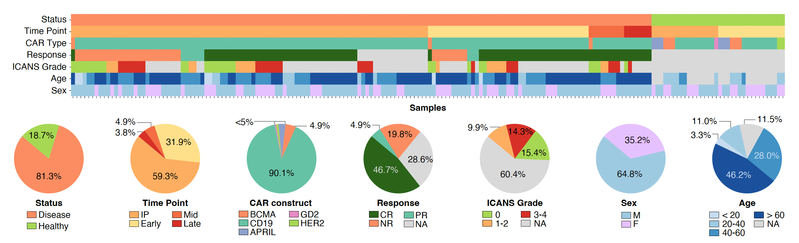
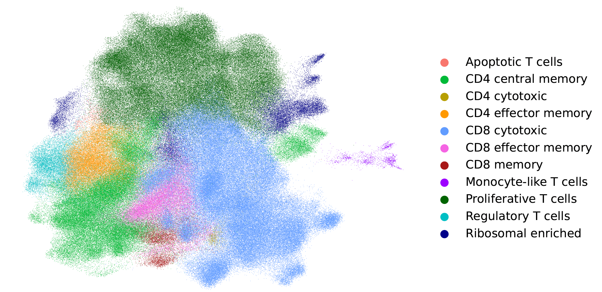

# An open CAR-T single-cell atlas to enable in-depth characterization and rational engineering of CAR-T products

📄 [**Read the preprint on bioRxiv**](https://www.biorxiv.org/content/10.1101/2025.10.11.681788v1)

## 👥 Authors

Sergio Cámara-Peña*, Paula Rodríguez-Márquez*, Nuria Planell, María E. Calleja-Cervantes, Lorea Jordana-Urriza, Giacomo Cinnirella, Shlomit Reich-Zeliger, Paula Rodríguez-Otero, Esteban Tamariz, Idoia Ochoa, Nir Yosef, Juan R. Rodríguez-Madoz‡, Felipe Prosper‡, and Mikel Hernaez‡  
(*Equal contribution; ‡Correspondence: jrrodriguez@unav.es, fprosper@unav.es, mhernaez@unav.es)

## 📖 Abstract

We built a **CAR-T cell functional atlas** from over one million cells across 13 studies, integrating data from patients and healthy donors.  
The atlas captures **11 phenotypes**, links **infusion product composition** with **clinical response**, and reveals **sex- and age-dependent effects**, **metabolic signatures**, and **rare ICANS-associated populations**.  
This open-access resource provides a foundation to understand CAR-T cell function and guide the rational design of next-generation therapies.  

The code provided in this repository enables full reproduction of the **CAR-T Cell Atlas**, from raw data preprocessing to integration, annotation, visualization, and public dissemination through a **ShinyCell** app and **scVI-hub**.  
Together, these resources ensure full reproducibility and facilitate the extension of the atlas to incorporate future CAR-T datasets.

## 🗄️ Repository Structure

```
1_Data_Preprocessing/
└─ Scripts to process individual datasets either from Cell Ranger, Drop-seq or authors' count matrix up to QC-filtered objects (prior to integration).

2_Integration_and_Annotation/
└─ Integration of all datasets with scVI and manual cell type annotation using curated markers.

3_Plotting/
└─ Code used to generate all figures and tables for the manuscript (main and supplementary).

4_New_Data_Integration/
└─ Workflow to incorporate new datasets into the atlas (from data preprocessing to scArches-scANVI model transfer - *Example with Jordana's dataset*).

5_Atlas_Sharing/
└─ Scripts and configurations for atlas distribution resources (ShinyCell app, scVI-hub model).
```

## 👀 Overview

### CAR-T dataset integration workflow
  
*Publicly available scRNA-seq data and associated metadata from 14 healthy donors and 102 patients with hematological malignancies were integrated, yielding 182 samples encompassing 414,000 CAR⁺ CD3⁺ T cells after quality control.*

### Metadata distribution across samples
  
*Distribution of key metadata features across samples, including disease status, time point, CAR construct, clinical response, ICANS grade, sex, and age. Time points are categorized as infusion product (IP), early (<2 weeks), mid (2 weeks–3 months), and late (>3 months). Sex is indicated as male (M) or female (F).*

### Final Annotated CAR-T Cell Atlas

*Complete manually annotated CAR-T cell atlas showing 11 phenotypes.*

## 🌍 Associated Resources

| Resource | Link |
|-----------|------|
| 🧬 **Zenodo (Atlas raw data)** | [https://doi.org/10.5281/zenodo.17213452](https://doi.org/10.5281/zenodo.17213452) |
| 🧠 **scVI-hub pretrained model** | [https://huggingface.co/sergiocamarap/Functional-cart-atlas-model](https://huggingface.co/sergiocamarap/Functional-cart-atlas-model) |
| 💻 **Interactive ShinyCell app** | [https://wholebioinfo.shinyapps.io/shinyatlas/](https://wholebioinfo.shinyapps.io/shinyatlas/) |

## 🧪 Demo dataset
To facilitate testing and demonstration of the code provided in this repository, we include a small demo dataset (`Atlas_DEMO.h5ad`) containing 1,000 randomly selected cells from the final version of the atlas.

This demo object is intended exclusively for software demonstration and reproducibility purposes, allowing users to run example workflows without downloading the full atlas dataset.

## ✍🏻 Citation

If you use this repository, please cite:

*An open CAR-T single-cell atlas to enable in-depth characterization and rational engineering of CAR-T products*.  
Sergio Camara-Pena, Paula Rodriguez-Marquez, Nuria Planell, Maria E Calleja-Cervantes, Lorea Jordana-Urriza, Giacomo Cinnirella, Shlomit Reich-Zeliger, Paula Rodriguez-Otero, Esteban Tamariz, Idoia Ochoa, Nir Yosef, Juan R Rodriguez-Madoz, Felipe Prosper, Mikel Hernaez  
bioRxiv 2025.10.11.681788; doi: https://doi.org/10.1101/2025.10.11.681788

## ⚙️ Environment and Reproducibility

All analyses were conducted using **Python (v3.8.10)** and **R (v4.5.1 / v4.1.3)** under **Ubuntu (20.04.6 LTS / 20.04.4 LTS)**.  
Package versions are listed below as referenced in the *Online Methods* section of the manuscript:

### R packages
- **Seurat** v4.3.0.1  
- **DoubletFinder** v2.0.3  
- **DropletUtils** v1.14.2  
- **SeuratDisk** v0.0.0.9020  
- **dreamlet** v1.0.3  
- **zenith** v1.4.2  
- **clusterProfiler** v4.2.2  
- **AUCell** v1.30.1  
- **ShinyCell** v2.1.0  

### Python packages
- **scvi-tools (scVI)** v0.20.3  
- **scGraph** v0.1.2  
- **Scanpy** v1.9.5  
- **milopy** v0.1.1  
- **scArches** v0.6.1  
- **scProportionTest** v0.1.2
- **Palantir** v1.3.6
