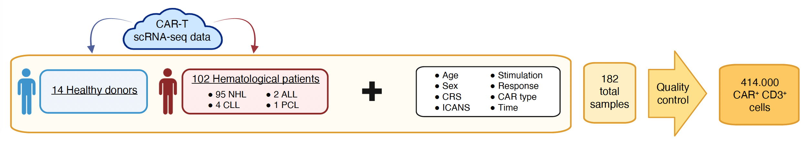
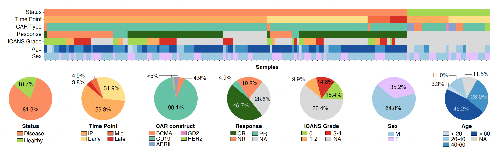
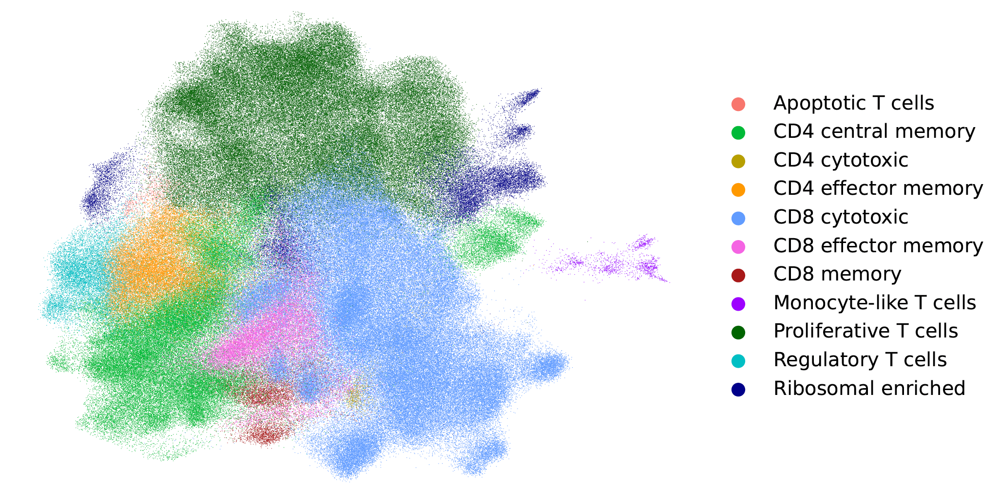

# An open CAR-T single-cell atlas to enable in-depth characterization and rational engineering of CAR-T products

📄 [**Read the preprint on bioRxiv**](https://www.biorxiv.org/content/10.1101/2025.10.11.681788v1)

## 👥 Authors

Sergio Cámara-Peña*, Paula Rodríguez-Márquez*, Nuria Planell, María E. Calleja-Cervantes, Lorea Jordana-Urriza, Giacomo Cinnirella, Shlomit Reich-Zeliger, Paula Rodríguez-Otero, Esteban Tamariz, Idoia Ochoa, Nir Yosef, Juan R. Rodríguez-Madoz‡, Felipe Prosper‡, and Mikel Hernaez‡  
(*Equal contribution; ‡Correspondence: jrrodriguez@unav.es, fprosper@unav.es, mhernaez@unav.es)

## 📖 Abstract

We built a **CAR-T cell functional atlas** from over one million cells across 13 studies, integrating data from patients and healthy donors. The atlas captures **11 phenotypes**, links **infusion product composition** with **clinical response**, and reveals **sex- and age-dependent effects**, **metabolic signatures**, and **rare ICANS-associated populations**. This open-access resource provides a foundation to understand CAR-T cell function and guide the rational design of next-generation therapies.  

The code provided in this repository enables full reproduction of the **CAR-T Cell Atlas**, from raw data preprocessing to integration, annotation, visualization, and public dissemination through a **ShinyCell** app, **scVI-hub**, and **UCSC Cell Browser**. Together, these resources ensure full reproducibility and facilitate the extension of the atlas to incorporate future CAR-T datasets.

## 🗄️ Repository Structure

```
.github/workflows/
└─ docker-smoke.yml                  GitHub Actions Docker smoke-test workflow.

Article/
├─ 1_Data_Preprocessing/             Individual dataset processing and quality control.
├─ 2_Integration_and_Annotation/     scVI integration and manual cell type annotation.
├─ 3_Plotting/                       Manuscript figures and tables.
├─ 4_New_Data_Integration/           New-dataset integration and scArches-scANVI transfer.
├─ 5_Atlas_Sharing/                  ShinyCell, scVI-hub and UCSC Cell Browser resources.
└─ Create_Article_Folder_Tree.py     Creates the analysis directory structure.

bioRxiv-deprecated/                  Archived code associated with the earlier preprint version.

docker/
├─ marg/                             Margaret Python and R Dockerfiles.
├─ roci/                             Rocinante Python and R Dockerfiles.
├─ smoke-tests/                      Local and CI smoke tests for the four images.
├─ images.lock                       Immutable GHCR image references used by CI.
└─ README_DOCKER.md                  Detailed build, usage and validation guide.

environments/
├─ marg/
│  ├─ Docker/                        Reduced, tested Docker runtime dependencies.
│  └─ Original/                      Original Margaret environment snapshots.
└─ roci/
   ├─ Docker/                        Reduced, tested Docker runtime dependencies.
   └─ Original/                      Original Rocinante environment snapshots.

figures/                             Figures displayed in this README.
Atlas_DEMO.h5ad                      Small demo dataset used by the smoke tests.
```

## 📁 Prepare the analysis directory tree

The analysis scripts use a shared repository-relative directory structure. To
create all currently required directories before starting at any stage of the
workflow, run:

```bash
python3 Article/Create_Article_Folder_Tree.py
```

To create the directory tree beneath a different project root:

```bash
python3 Article/Create_Article_Folder_Tree.py \
  --project-dir /path/to/cart-atlas-project
```

The utility creates only missing directories and can be run repeatedly.
Existing files, directories, symbolic links, and their contents are never
deleted, moved, renamed, or overwritten. It creates the required directory
structure but does not create or download any input data files.

## 🐳 Docker

The analyses were run on two workstations, referred to throughout this
repository by their code names: **Rocinante** ran **Ubuntu 20.04.6 LTS**, while
**Margaret** ran **Ubuntu 20.04.4 LTS**. Four public Docker images reproduce
their Python and R runtime environments. They can be pulled anonymously from
the GitHub Container Registry (GHCR) and target `linux/amd64`.

Each analysis script under `Article/` identifies its original workstation with
a `# Machine: Rocinante` or `# Machine: Margaret` header. Combine this label
with the `.py` or `.R` file extension to select the corresponding image in the
table below.

> **Beta notice:** The Docker images are currently in beta and remain under
> active testing. Bugs may still be encountered; reports are welcome through
> [GitHub Issues](https://github.com/ML4BM-Lab/Functional-cart-atlas/issues).

| Environment | Runtime | Public image |
|-------------|---------|--------------|
| Rocinante | Python 3.8.10 | `ghcr.io/ml4bm-lab/functional-cart-atlas-python-roci:0.1.0` |
| Rocinante | R 4.5.1 | `ghcr.io/ml4bm-lab/functional-cart-atlas-r-roci:0.1.0` |
| Margaret | Python 3.8.10 | `ghcr.io/ml4bm-lab/functional-cart-atlas-python-marg:0.1.0` |
| Margaret | R 4.1.3 | `ghcr.io/ml4bm-lab/functional-cart-atlas-r-marg:0.1.0` |

As a minimal example, the Margaret Python image can be downloaded and opened
with the local repository mounted as follows:

```bash
ATLAS=/absolute/path/to/Functional-cart-atlas

docker pull ghcr.io/ml4bm-lab/functional-cart-atlas-python-marg:0.1.0

docker run --rm -it \
  --mount type=bind,source="$ATLAS",target="$ATLAS" \
  --workdir "$ATLAS" \
  ghcr.io/ml4bm-lab/functional-cart-atlas-python-marg:0.1.0 \
  bash
```

Replace `/absolute/path/to/Functional-cart-atlas` with the absolute path to the
local repository. The directory is mounted read-write by default; append
`,readonly` to the mount specification when write access is not required. See
the [detailed Docker guide](https://github.com/ML4BM-Lab/Functional-cart-atlas/blob/main/docker/README_DOCKER.md)
for all four images, build instructions, local smoke-test commands and rootless
Docker usage.

### Docker smoke tests

[](https://github.com/ML4BM-Lab/Functional-cart-atlas/actions/workflows/docker-smoke.yml)

Each image has a dedicated test under `docker/smoke-tests/`. The same tests run
locally and in GitHub Actions against `Atlas_DEMO.h5ad`.

These smoke tests check essential runtime, package, bridge and demo-file
operations. They are intentionally lightweight and do not replace end-to-end
reproduction of every scientific analysis in `Article/`.

## 👀 Overview

### CAR-T dataset integration workflow
  
*Publicly available scRNA-seq data and associated metadata from 14 healthy donors and 102 patients with hematological malignancies were integrated, yielding 182 samples encompassing 414,000 CAR⁺ CD3⁺ T cells after quality control.*

### Metadata distribution across samples
  
*Distribution of key metadata features across samples, including disease status, time point, CAR construct, clinical response, ICANS grade, sex, and age. Time points are categorized as infusion product (IP), early (<2 weeks), mid (2 weeks–3 months), and late (>3 months). Sex is indicated as male (M) or female (F).*

### Final Annotated CAR-T Cell Atlas

*Complete manually annotated CAR-T cell atlas showing 11 phenotypes.*

## 🌍 Associated Resources

| Resource | Link |
|-----------|------|
| 🧬 **Zenodo (Atlas raw data)** | [https://doi.org/10.5281/zenodo.17213452](https://doi.org/10.5281/zenodo.17213452) |
| 🧠 **scVI-hub pretrained model*** | [https://huggingface.co/sergiocamarap/Functional-cart-atlas-model](https://huggingface.co/sergiocamarap/Functional-cart-atlas-model) |
| 💻 **Interactive ShinyCell app** | [https://wholebioinfo.shinyapps.io/shinyatlas/](https://wholebioinfo.shinyapps.io/shinyatlas/) |
| 🔎 **UCSC Cell Browser** | [https://car-t-atlas.cells.ucsc.edu](https://car-t-atlas.cells.ucsc.edu) |

\* A template script to easily download the pretrained scVI model is available in `Article/5_Atlas_Sharing/scVI-hub/scVI-hub_Download.py`.

## 🧪 Demo dataset
To facilitate testing and demonstration of the code provided in this repository, we include a small demo dataset (`Atlas_DEMO.h5ad`) containing 1,000 randomly selected cells from the final version of the atlas.

This demo object is intended exclusively for software demonstration and reproducibility purposes, allowing users to run example workflows without downloading the full atlas dataset.

## ✍🏻 Citation

If you use this repository, please cite:

*An open CAR-T single-cell atlas to enable in-depth characterization and rational engineering of CAR-T products*.  
Sergio Camara-Pena, Paula Rodriguez-Marquez, Nuria Planell, Maria E Calleja-Cervantes, Lorea Jordana-Urriza, Giacomo Cinnirella, Shlomit Reich-Zeliger, Paula Rodriguez-Otero, Esteban Tamariz, Idoia Ochoa, Nir Yosef, Juan R Rodriguez-Madoz, Felipe Prosper, Mikel Hernaez  
bioRxiv 2025.10.11.681788; doi: https://doi.org/10.1101/2025.10.11.681788

## ⚙️ Environment and Reproducibility

All analyses were conducted using **Python (v3.8.10)** and **R (v4.5.1 / v4.1.3)** under **Ubuntu (20.04.6 LTS / 20.04.4 LTS)**.  
Package versions are listed below as referenced in the *Online Methods* section of the manuscript:

Exact environment records are available under `environments/`:
`environments/*/Original/` preserves the original workstation snapshots, while
`environments/*/Docker/` contains the reduced, tested runtime dependencies used
to build the Docker images.

### R packages
- **Seurat** v4.3.0.1
- **DoubletFinder** v2.0.3
- **DropletUtils** v1.14.2
- **SeuratDisk** v0.0.0.9020
- **dreamlet** v1.6.0
- **zenith** v1.10.0
- **clusterProfiler** v4.16.0 / v4.2.2
- **AUCell** v1.30.1
- **ShinyCell** v2.1.0

### Python packages
- **scvi-tools (scVI)** v0.20.3
- **scGraph** v0.1.2
- **scanpy** v1.9.8 / v1.9.5
- **milopy** v0.1.1
- **scArches** v0.6.1
- **scProportionTest** v0.1.2
- **palantir** v1.3.6
- **anndata** v0.9.2
- **mudata** v0.2.3
- **numpy** v1.24.4 / v1.23.5
- **pandas** v2.0.3 / v1.5.1
- **scib-metrics** v0.3.3
